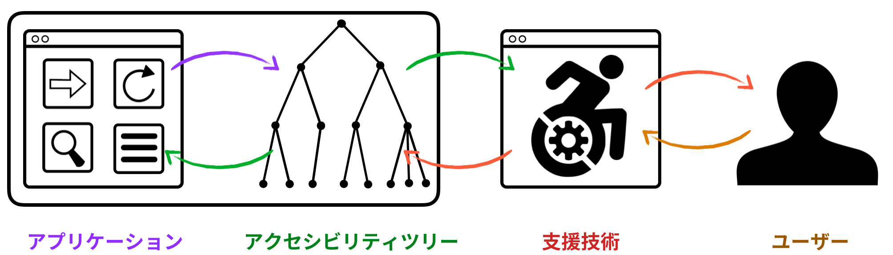
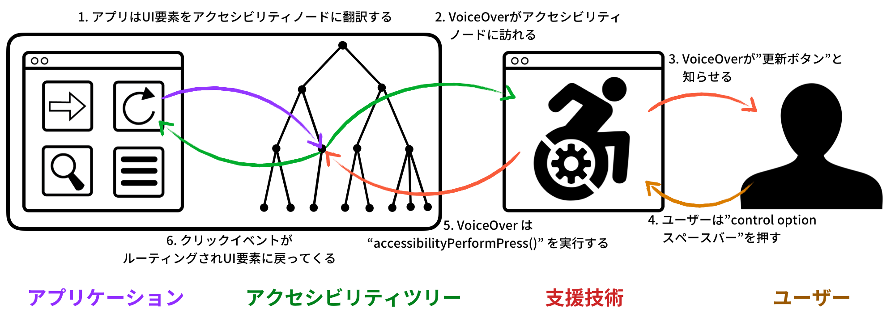
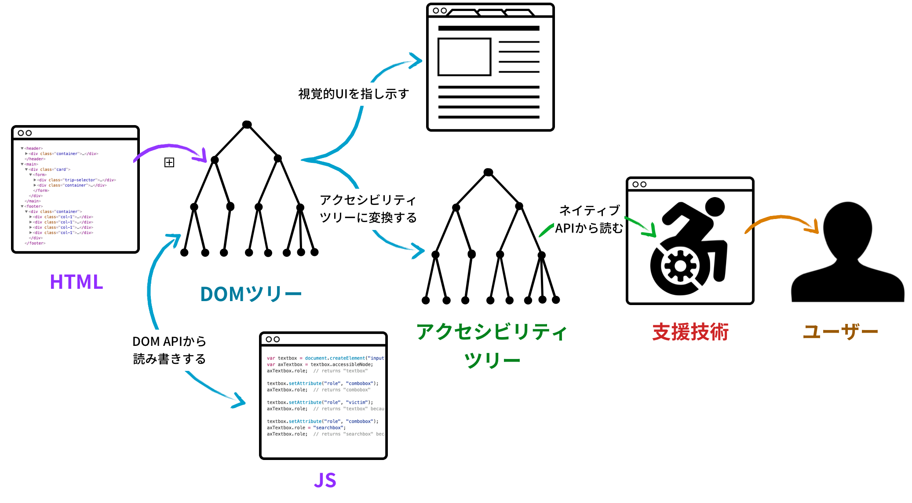
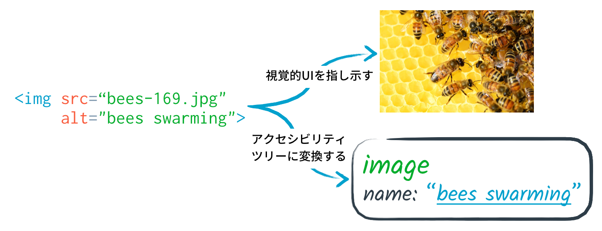

# アクセシビリティオブジェクトモデル

**著者:**

* Alice Boxhall, Google, aboxhall@google.com
* James Craig, Apple, jcraig@apple.com
* Dominic Mazzoni, Google, dmazzoni@google.com
* Alexander Surkov, Mozilla, surkov.alexander@gmail.com

<!-- START doctoc generated TOC please keep comment here to allow auto update -->
<!-- DON'T EDIT THIS SECTION, INSTEAD RE-RUN doctoc TO UPDATE -->
**Table of Contents**

  - [はじめに](#introduction)
  - [モチベーションとなるユースケース](#motivating-use-cases)
  - [アクセシビリティオブジェクトモデル](#the-accessibility-object-model)
    - [ARIA属性を反映する](#reflecting-aria-attributes)
    - [要素の参照を反映する](#reflecting-element-references)
      - [Use case 2: Setting relationship properties without needing to use IDREFs](#use-case-2-setting-relationship-properties-without-needing-to-use-idrefs)
    - [Custom ElementsのAPI](#custom-elements-apis)
      - [ユースケース1: 非反映のデフォルトアクセシビリティプロパティをウェブコンポーネントに設定する](#use-case-1-setting-non-reflected-default-accessibility-properties-for-web-components)
        - [customElements.define() を利用したデフォルトセマンティクス](#default-semantics-via-customelementsdefine)
        - [`ElementInternals` オブジェクトを利用した動的なインスタンス単位のセマンティクス](#per-instance-dynamic-semantics-via-the-createdcallback-reaction)
    - [支援技術からのユーザーアクションイベント](#user-action-events-from-assistive-technology)
      - [新しい入力イベントタイプ](#new-inputevent-types)
      - [ユースケース 3: 支援技術からのイベントをリッスンする](#use-case-3-listening-for-events-from-assistive-technology)
    - [仮想アクセシビリティノード](#virtual-accessibility-nodes)
      - [ユースケース4; DOMでない仮想のノードをアクセシビリティツリーに追加する](#use-case-4-adding-non-dom-nodes-virtual-nodes-to-the-accessibility-tree)
    - [`ComputedAccessibleNode` によるアクセシビリティツリーの完全な確認](#full-introspection-of-an-accessibility-tree---computedaccessiblenode)
      - [ユースケース5: 計算されたツリーを確認する](#use-case-5--introspecting-the-computed-tree)
      - [なぜ最終的に計算されたプロパティにアクセスするのか](#why-is-accessing-the-computed-properties-being-addressed-last)
    - [このAPIの対象者](#audience-for-the-proposed-api)
    - [`AccessibleNode`に何が起こったのか?](#what-happened-to-accessiblenode)
  - [次のステップ](#next-steps)
    - [インキュベーション](#incubation)
  - [謝辞](#additional-thanks)
- [付録](#appendices)
  - [Background: assistive technology and the accessibility tree](#background-assistive-technology-and-the-accessibility-tree)
    - [Accessibility node properties](#accessibility-node-properties)
  - [Background: DOM tree, accessibility tree and platform accessibility APIs](#background-dom-tree-accessibility-tree-and-platform-accessibility-apis)
    - [Mapping native HTML to the accessibility tree](#mapping-native-html-to-the-accessibility-tree)
    - [ARIA](#aria)
  - [Appendix: `AccessibleNode` naming](#appendix-accessiblenode-naming)

<!-- END doctoc generated TOC please keep comment here to allow auto update -->

## はじめに

このJavaScript APIを作る努力の目的は、開発者にHTMLページのアクセシビリティツリーの変更（ついには探索まで）を許可するためである。

## モチベーションとなるユースケース

既存のAPIの背景は[付録](#appendices)で見つけることができる。

ウェブ上でできることの境界を押し広げているウェブアプリケーションは、APIが不十分なためそれらをアクセシブルにするため苦闘している。特に、ブラウザとやりとりするネイティブAPIと比較して表現力に劣っている。

1. ページの著者が上書きできる[ウェブコンポーネント](https://developer.mozilla.org/en-US/docs/Web/Web_Components)のデフォルトアクセシビリティプロパティの設定
    - 現在、ウェブコンポーネントのデフォルトセマンティクスを定義するにはARIAを使用しなければならない。
    これにより、真に詳細な実装であるARIA属性がDOMに「リーク」してしまう。
    - このことは必要では _なく_ ウェブコンポーネントに限られる _かも_ 知れない。
2. IDREFs を必要としない[関係属性](https://www.w3.org/TR/wai-aria-1.1/#attrs_relationships)の設定
    - 現在、いくつかのARIAの関係を示すには、著者が一意のIDを関係の対象となりうる要素に指定しなければならない
    - [`aria-activedescendant`](https://www.w3.org/TR/wai-aria-1.1/#aria-activedescendant)のような場合、
    それはUIに応じて、数百ないしは数千もの要素のうち、一つを参照するかもしれない。
    この要求は、多くの余分なDOMの属性が必要となり、これらのAPIを複雑にする。
3. 支援技術からのイベントをリスニングする
   - 現在、組み込み要素 _だけ_ がイベントに反応することができ、
   通常、["simulated click"](https://developer.android.com/reference/android/view/accessibility/AccessibilityEvent.html#TYPE_VIEW_CLICKED) や ["increment"](https://developer.apple.com/documentation/objectivec/nsobject/1615076-accessibilityincrement) のようなユーザーアクションによって引き起こされる。
4. アクセシビリティツリーにDOMでないノード（仮想ノード）を追加する
   - 例えば、`<canvas>` 要素で構築された複雑なUIや、`<video>` 要素を用いたリモートデスクトップのストリーミングなどを表現するなど
   - そのためには、少なくとも要素と同じようなアクセシビリティプロパティや、他の仮想ノードとの親/子/その他の関係性、位置や次元を表す必要がある。
5. 計算済のアクセシビリティツリーの確認
   - 開発者は現在、ARIAやその他のアクセシブルプロパティがどのように適用されているかを調べたりテストする方法を持っていない。

## アクセシビリティオブジェクトモデル

アクセシビリティオブジェクトモデル (AOM)は、上記のユースケースに取り組むためのHTMLや関連する標準に対する一連の変更である。

(注: 以前のバージョンのAOMに慣れ親しんでいれば、[`AccessibleNode`に何が起こったのか?](#what-happened-to-accessiblenode))と疑問を持つかもしれない。

### ARIA属性を反映する

ARIA 属性をHTML要素に[反映する](https://html.spec.whatwg.org/multipage/common-dom-interfaces.html#reflect)。

これは今[ARIA 1.2の仕様](https://www.w3.org/TR/wai-aria-1.2/#idl-interface)の一部となった。

```js
el.role = "button";
el.ariaPressed = "true";  // aria-pressed は3つのステートを持つ属性
el.ariaDisabled = true;   // aria-disabled は true/false を持つ属性
```

### 要素の参照を反映する

ARIAプロパティを直接反映、`aria-labelledby` のような関係属性の文字列に反映させる。

```js
el.ariaDescribedBy = "id1";
```

結果は

```html
<div aria-describedby="id1">
```

要素を参照する非反映のプロパティでAPIを拡張することを提案

```js
el.ariaDescribedByElements = [labelElement1, labelElement2];
el.ariaActiveDescendantElement = ownedElement1;
```

これにより、関係に属するそれぞれの要素にグローバルに固有のID属性を割り当てることなく要素間のセマンティクスの関係性を示すことができる。

さらにこれは、`ShadowRoot`を使用した著者がShadow DOMの境界を超えて関係性を明示することを可能にする

このAPIはWHATWG HTML仕様の変更として提案されている。

#### ユースケース 2: IDREFsを使用することなく関係プロパティを設定する

現在、Shadow DOMの境界を超えて関係を表そうとする著者は次のように `aria-activedescendant` の使用を試すだろう。

```html
<custom-combobox>
  #shadow-root (open)
  |  <!-- これはうまくいかない！ -->
  |  <input aria-activedescendant="opt1"></input>
  |  <slot></slot>
  <custom-optionlist>
    <x-option id="opt1">Option 1</x-option>
    <x-option id="opt2">Option 2</x-option>
    <x-option id='opt3'>Option 3</x-option>
 </custom-optionlist>
</custom-combobox>
```

これは失敗で、なぜならIDREFsはshadowRoot、またはそれらが現れる文書の文脈の範囲に限られる。

著者は代わりにこの関係性をプログラムで示すことができる。

```js
const input = comboBox.shadowRoot.querySelector("input");
const optionList = comboBox.querySelector("custom-optionlist");
input.activeDescendantElement = optionList.firstChild;
```

This would allow the relationship to be expressed naturally.

このことにより、関係が自然に表現されるようになる。

このAPIはWHATWG HTMLリポジトリの[issue #3513](https://github.com/whatwg/html/issues/3515#issuecomment-413716944)で議論されている。

### Custom ElementsのAPI

Custom Elementの著者が `customElements.define()` オプションを用いて静的なデフォルトセマンティクス、または設定されたコールバックを用いて動的に要素ごとのセマンティクスを提供できることを提案する。

#### ユースケース1: 非反映のデフォルトアクセシビリティプロパティをウェブコンポーネントに設定する

今、ウェブコンポーネントを制作するライブラリの著者はネイティブ要素にとっては暗黙であるセマンティクスを表すためにARIA属性を"生やす"ことを強いられている。

```html
<!-- ページの著者はCustom elementをネイティブ要素を使用するように使用する -->
<custom-tablist>
  <custom-tab selected>Tab 1</custom-tab>
  <custom-tab>Tab 2</custom-tab>
  <custom-tab>Tab 3</custom-tab>
</custom-tablist>

<!-- Custom elements がセマンティクスを表すために余分な属性を"生やす"ことを強制される -->
<custom-tablist role="tablist">
  <custom-tab selected role="tab" aria-selected="true" aria-controls="tabpanel-1">Tab 1</custom-tab>
  <custom-tab role="tab" aria-controls="tabpanel-2">Tab 2</custom-tab>
  <custom-tab role="tab" aria-controle="tabpanel-3">Tab 3</custom-tab>
</custom-tablist>
```

##### customElements.define() を利用したデフォルトセマンティクス

著者は `CustomElementRegistry.define()` メソッドに渡された `ElementDefinitionOptions` オブジェクトを利用して、不変のデフォルトセマンティクスをカスタム要素に提供することもできる。

`ElementDefinitionOptions` オブジェクトに設定されたプロパティは、カスタム要素をアクセシブルなオブジェクトにマッピングする際に、デフォルトの値として利用される。

注: これは "不変なクラス変数" を作るのに類似している。これらのセマンティクスプロパティはカスタム要素の定義に関連付けられていて、カスタム要素のインスタンスには関連していない。

定義されたセマンティクスは *すべての* カスタム要素のインスタンスに適用される。

例えば、カスタムタブコントロールを作成する著者は、タブ、タブリスト、タブパネルの3つのカスタム要素を個々に定義することができる。

```js
class TabListElement extends HTMLElement { ... }
customElements.define("custom-tablist", TabListElement,
                      { role: "tablist", ariaOrientation: "horizontal" });

class TabElement extends HTMLElement { ... }
customElements.define("custom-tab", TabElement,
                      { role: "tab" });

class TabPanelElement extends HTMLElement { ... }
customElements.define("custom-tabpanel", TabPanelElement,
                      { role: "tabpanel" });
```

`<custom-tab>`がアクセシビリティツリーにマッピングされるとき、タブのロールがデフォルトでマッピングされる。

これは `button` 要素がデフォルトでボタンのロールを持ってアクセシビリティオブジェクトにマッピングされるのに似ている。

##### `ElementInternals` オブジェクトを利用した動的なインスタンス単位のセマンティクス

これは[W3C Web Componentsプロジェクトの一部として議論されている](https://github.com/w3c/webcomponents/issues/758).

カスタム要素の著者は `ElementInternals` オブジェクトを、ユーザーインタラクションに応じてカスタム要素のインスタンスのセマンティクスの状態を変更するのに利用できる。

`ElementInternals` オブジェクトにセットされたプロパティはアクセシビリティオブジェクトに要素をマッピングされる際に利用される。

注: これは "インスタンス変数" を設定するのに類似している。セマンティクスプロパティのコピーはカスタム要素のインスタンス毎に作られる。それぞれに定義されたセマンティクスは関連するカスタム要素のインスタンスオブジェクトにのみ関連付けられる。

```js
class CustomTab extends HTMLElement {
  #internals = null;
  #tablist = null;
  #tabpanel = null;

  constructor() {
    super();
    this.#internals = customElements.createInternals(this);
    this.#internals.role = "tab";
  }

  // カスタム "active" 属性を監視する
  static get observedAttributes() { return ["active"]; }

  connectedCallback() {
    this.#tablist = this.parentElement;
  }

  setTabPanel(tabpanel) {
    if (tabpanel.localName !== "custom-tabpanel" || tabPanel.id === "")
      return;  // 静かに失敗する

    this.#tabpanel = tabpanel;
    tabpanel.setTab(this);
    this.#internals.ariaControls = tabPanel;    // 反映されない
  }

  // 属性に反映するカスタムプロパティの setters/getters

  attributeChangedCallback(name, oldValue, newValue) {
    switch(name) {
      case "active":
        let active = (newValue != null);
        this.#tabpanel.shown = active;

        // カスタム "active" 属性が変更された時、
        // アクセシブルな "selected" ステートを同期し続ける
        this.#internals.ariaSelected = (newValue !== null);

        if (selected)
          this.#tablist.setSelectedTab(this);  // 他のタブが "active" で無いことを保証
        break;
    }
  }
}

customElements.define("custom-tab", CustomTab, { role: "tab", needsElementInternals: true });
```

これらの要素を使用する著者は通常通りARIAを用いてデフォルトセマンティクスを上書きすることができる。

例えば、著者は `<custom-tablist>` 要素の見た目を縦並びに変更できる。彼らはそれを示すために `aria-orientation` 属性を追加することで、カスタム要素に定義されているデフォルトセマンティクスを上書きすることができる。

```html
<custom-tablist aria-orientation="vertical" class="vertical-tablist">
  <custom-tab selected>Tab 1</custom-tab>
  <custom-tab>Tab 2</custom-tab>
  <custom-tab>Tab 3</custom-tab>
</div>
```

著者が提供するロールがデフォルトのロールを上書きするので、それぞれの場合においてマッピングされるロールは著者が提供するロールに基づく。

仮に著者によって提供されたセマンティクスが Custom Element のセマンティクスと競合する場合でも著者が提供するセマンティクスが優先される。

### 支援技術からのユーザーアクションイベント

支援技術ユーザーのプライバシーを保護するために、通常、支援技術からのイベントは合成されたDOMイベントを発生させる。

| **支援技術のイベント** | **ターゲット** | **DOMイベント** |
|---------------------|--------------|----------------|
| `click`             | *すべての要素* | `click` |
| `focus`             | *すべての要素* | `focus` |
| `select`            | `cell` または `option` ロールがマッピングされた要素 | `click` |
| `scrollIntoView`    | (n/a) | イベントなし |
| `dismiss`           | *すべての要素* | `Escape` キーのキーが押されたシーケンス |
| `contextMenu`       | *すべての要素* | `contextmenu` |
| `scrollByPage`      | *すべての要素* | スクロール方向に応じた `PageUp` または `PageDown` キーが押されたシーケンス |
| `increment`         | `progressbar`、 `scrollbar`、 `slider` または `spinbutton` ロールがマッピングされた要素 | `Up` キーのキーが押されたシーケンス |
| `decrement`         | `progressbar`、 `scrollbar`、 `slider` または `spinbutton` ロールがマッピングされた要素 | `Down` キーが押されたシーケンス |
| `setValue`          | `combobox`、 `scrollbar`、 `slider` または `textbox` キーが押されたシーケンス | 未定  |

#### 新しい入力イベントタイプ

いくつかの[`Input Event`](https://www.w3.org/TR/uievents/#inputevent) タイプを追加する:

* `increment`
* `decrement`
* `dismiss`
* `scrollPageUp`
* `scrollPageDown`

これらのイベントは上記の表に記載された合成キーボードイベントと共に支援技術のイベントから引き起こされ、
また上記の関連する支援技術のイベントに対応した有効なターゲットの文脈の中で発生したときに合成される。

例えば、もしある文脈で支援技術を使用していないユーザーが `Escape` キーを押した場合、キーが押されたシーケンスで `dismiss` タイプを伴った `input` イベントが発火する。

もし同じユーザーが `<input type="range">` *または* （計算された `slider` ロールを含む）`slider` ロールを持った要素上にフォーカスがある `Up` キーを押した場合、キーが押されたシーケンスで `increment` タイプを伴った `input` イベントがフォーカスされた要素で発火される。

#### ユースケース 3: 支援技術からのイベントをリッスンする

例えば:

* ユーザーは音声制御ソフトウェアを利用しており、ウェブページの中のどこかのボタンの名前を読み上げられる。音声制御ソフトウェアはアクセシビリティツリーの中に該当する名前があるボタンを見つけ、クリックすることで *アクション* を送信することができる。
* 同じユーザーはあるページをスクロールダウンする音声コマンドを発行する。その音声制御ソフトウェアはウェブページのルート要素を見つけ、スクロール *アクション* を送信する。
* モバイルスクリーンリーダーユーザーは、スライダーに移動し、範囲に基づいたコントロールを増加させるジェスチャーを実行することができる。スクリーンリーダーはアクセシビリティツリーの中のスライダー要素にブラウザーに増加 *アクション* を送信する。

現在、ブラウザーはネイティブHTML要素の組み込みサポートを実装することによって、アクセシブルアクションを一部実装している。（例えばネイティブHTMLの `<input type="range">` はすでに増加・減少アクションをサポートし、テキストボックスは値を設定したりテキストを挿入するアクションをサポートしている。）

しかしウェブページの著者がカスタムエレメント上のアクセシブルアクションをリッスンする方法が無い。
例えば、`slider` [ロールを持ったカスタムスライダー]((#use-case-1-setting-non-reflected-default-accessibility-properties-for-web-components) 上ではiOSのVoiceOverでは増加・現象のためにスワイプアクションを促す提案がされるが、いかなるウェブAPIもそのセマンティックイベントを扱うことができない。

開発者はセマンティックイベントを補足するようなキーボードイベントまたは入力イベントをリッスンすることができるようになるだろう。

例えば、著者はカスタムスライダーを実装するために [ARIA Authoring Practices guide](https://www.w3.org/TR/wai-aria-practices-1.1/#slider_kbd_interaction)で推奨されている `Up` と `Down` キーイベントを扱うことができ、同じように支援技術のイベントも扱うことができる。

```js
customSlider.addEventListener('keydown', (event) => {
  switch (event.code) {
  case "ArrowUp":
    customSlider.value += 1;
    return;
  case "ArrowDown":
    customSlider.value -= 1;
    return;
});
```

### 仮想アクセシビリティノード

**仮想アクセシビリティノード** は著者が支援技術に特定のDOM要素に直接関係のない *仮想* のアクセシビリティノードに触れさせられることができるだろう。

このメカニズムは、著者がカスタム描画APIのアクセシビリティをよりきめ細かくコントロールするためにネイティブアクセシビリティAPIによく存在する。

```IDL
// AccessibuleNode は仮想のアクセシビリティノードを表している。
interface AccessibleNode {
    attribute DOMString? role;
    attribute DOMString? name;

    attribute DOMString? autocomplete;
    // ... その他すべてのARIAと同等の属性

    // 仮想ノードのためだけの重要なARIAと同等でない属性
    attribute DOMString? offsetLeft;
    attribute DOMString? offsetTop;
    attribute DOMString? offsetWidth;
    attribute DOMString? offsetHeight;
    attribute AccessibleNode? offsetParent;

    // アクセシブルフォーカスだけの影響
    boolean focusable;

    // ツリーをたどる
    readonly attribute AccessibleNode? parent;
    readonly attribute ComputedAccessibleNode? firstChild;
    readonly attribute ComputedAccessibleNode? lastChild;
    readonly attribute ComputedAccessibleNode? previousSibling;
    readonly attribute ComputedAccessibleNode? nextSibling;

    // アクション
    void focus();

    // ツリーの変更
    AccessibleNode insertBefore(AccessibleNode node, Node? child);
    AccessibleNode appendChild(AccessibleNode node);
    AccessibleNode replaceChild(AccessibleNode node, AccessibleNode child);
    AccessibleNode removeChild(AccessibleNode child);
};

```

```idl
partial interface Element {
  AccessibleNode attachAccessibleRoot();
}
```

- `attachAccessibleRoot()` を実行することで `AccessibleNode` が `Node` に関連付けられる。
  - リターンされた `AccessibleNode` は仮想アクセシビリティツリーのルートを形成する。
  - そのノードのDOM子要素は、`AccessibleRoot` が付与されると、暗黙のうちに無視され、DOMの子要素と仮想アクセシブルノードが混在することはない。
- `ShadowRoot` のように、一つの要素は一つの関連付けられた `AccessibleRoot` しか持たない。
- `AccessibleNode` だけが子に `AccessibleNodes` 持ち、 `AccessibleNode` は `AccessibleNode` のみ子として持つ。

#### ユースケース4; DOMでない仮想のノードをアクセシビリティツリーに追加する

例えば、`<canvas>` 要素から構築された複雑なUIを表すには:

```js
// canvas ベースのスプレッドシートのセマンティクスを実現する
canvas.attachAccessibleRoot();
let table = canvas.accessibleRoot.appendChild(new AccessibleNode());
table.role = 'table';
table.colCount = 10;
table.rowcount = 100;
let headerRow = table.appendChild(new AccessibleNode());
headerRow.role = 'row';
headerRow.rowindex = 0;
// などなど
```

仮想ノードは通常位置と寸法を明示的に設定する必要がある。

```js
cell.offsetLeft = "30px";
cell.offsetTop = "20px";
cell.offsetWidth = "400px";
cell.offsetHeight = "300px";
cell.offsetParent = table;
```

もし offsetParent を設定しない場合、アクセシブルノードの親を基準として解釈される。

ノードをフォーカサブルにする場合、 `focusable` 属性を設定することができる。これは tabIndex=-1 をDOM要素に設定するのに似ている。

```js
virtualNode.focusable = true;
```

仮想アクセシブルノードはデフォルトではフォーカスできない。

最後に、アクセシビリティノードにフォーカスするには、 focus() メソッドを実行する。

```js
virtualNode.focus();
```

仮想アクセシブルノードがフォーカスされたとき、DOMのフォーカスは変わらない。アクセシビリティノードのフォーカスは、支援技術や他のアクセシビリティAPIクライアントに伝わるが、DOMイベントは発火せず document.activeElementも変わらない。

DOM要素のフォーカスが変わった時、アクセシブルフォーカスも追従し、DOM要素に関連付けられたアクセシブルノードがフォーカスされる。

### `ComputedAccessibleNode` によるアクセシビリティツリーの完全な確認

```idl
partial interface Window {
  [NewObject] ComputedAccessibleNode getComputedAccessibleNode(Element el);
}
```

```idl
interface ComputedAccessibleNode {
    // アクセシビリティノードと同じだが、読み取り専用
    readonly attribute DOMString? role;
    readonly attribute DOMString? name;

    readonly attribute DOMString? autocomplete;
    // ... その他すべてのARIAと同等の属性

    // ARIAと同等でない属性
    readonly attribute DOMString? offsetLeft;
    readonly attribute DOMString? offsetTop;
    readonly attribute DOMString? offsetWidth;
    readonly attribute DOMString? offsetHeight;
    readonly attribute AccessibleNode? offsetParent;
    readonly boolean focusable;

    readonly attribute AccessibleNode? parent;
    readonly attribute ComputedAccessibleNode? firstChild;
    readonly attribute ComputedAccessibleNode? lastChild;
    readonly attribute ComputedAccessibleNode? previousSibling;
    readonly attribute ComputedAccessibleNode? nextSibling;
};

```

#### ユースケース5: 計算されたツリーを確認する

*計算されたアクセシビリティツリー* APIは著者に、完全な計算されたアクセシビリティツリーにアクセスすることを許可する。
それぞれのDOM要素に関連付けられたアクセシビリティノードのすべての計算されたプロパティに加え、仮想ノードを含む計算された木構造を走査可能にする。

このことは次のことを可能にする:
* ページ、または要素のセマンティックプロパティが確からしいか確認するプログラムによるテストを書くこと
* ブラウザーベースの信頼できる支援技術の構築。例えば、アクセシビリティツリーを利用したスクリーンリーダー、スクリーンルーペ、または他の支援機能を持ったブラウザー拡張やページ内ツール。
* アクセシブルプロパティが（ARIAなどを通じて）要素に正しく適用されたかを検査する。例えば、ブラウザが特定のバージョンのARIAに対応しているかを検査できる。
* アクセシビリティツリーの問題をコンソールベースでデバッグしたりチェックしたりする。
* アクセシビリティツリーの状態に反応する。例えば要素に表されたロールを検査したり、アクセシブルなヘルプテキストを変更したりなど。

#### なぜ最終的に計算されたプロパティにアクセスするのか

**一貫性**
現在、アクセシビリティツリーはブラウザ間で標準化されていない。それぞれのアクセシビリティツリーの計算は実装がわずかに異なります。

このAPIが役に立つには、ブラウザ間で一貫して動作することが必要で、開発者はそれぞれに特別なコードを書く必要がない。

我々はツリーがどのように計算され表現されるかについて合意ができるよう十分な時間をかけていきたいと考えている。

**パフォーマンス**
多くのアクセシビリティプロパティを計算するにはレイアウトが必要となる。ウェブ制作者に単純なプロパティアクセスと同期してアクセシビリティプロパティの計算された値を調べることを許可すると、パフォーマンスのボトルネックに混乱をもたらしてしまう。

このことから `accessibleNode` インターフェースの一部を意味しない非同期的なメカニズムを作成したいと考えている。

**ユーザー体験**
前の3つと比較して計算されたアクセシビリティツリーにアクセスすることはユーザーに与える影響が最小限となる。[優先順位の構成要素](https://www.w3.org/TR/html-design-principles/#priority-of-constituencies)の考え方の元、このことに最後に取り組むことは理にかなっている。

### このAPIの対象者

このAPIは主に、ウェブアプリの多くを動かしているJavaScriptフレームワークやウィジェットライブラリーを制作、メンテナンスしている比較的少数の開発者に興味を持たれるだろう。

それらのフレームワークやライブラリーにとってアクセシビリティは、可能な限り幅広く多様な文脈で使用されるようになるため、重要な目標の一つである。

低レベルのAPIよって彼らは制約やバグを回避し、彼らの制作したコンポーネントを使用する開発者のためにクリーンな高レベルのインターフェースを提供できるようになる。

このAPIはウェブプラットフォームの境界を押し広げるような巨大なフラッグシップウェブアプリの開発者をも対象としている。

これらのアプリの開発チームでは、Canvasのような低レベルAPIを利用してでもパフォーマンスを向上させたがっていることがしばしばある。

そのような開発チームだと、アクセシビリティを優先するだけのリソースもあるが、既存のAPIでは非常に面倒である。

### `AccessibleNode`に何が起こったのか?

当初の意図としては、これまでのユースケースを読み書き可能なAPIにまとめるものだった。それはそれぞれのDOMの `Element` に、アクセシビリティプロパティを読み込んだり書き込んだりできる `AccessibleNode` が関連付けられているという点でDOMに似ていた。

これはドキュメントオブジェクトモデルと似たようなアクセシビリティオブジェクトモデルと命名された。

しかし、議論が進むにつれこのモデルにはいくつかの問題があることがわかってきた。
- アクセシビリティツリーを計算することは、それを変更するために必要にはならない。書き込むための `AccessibleNode` を取得することは、計算済のプロパティを取得することに依存してはならない
- 計算されたアクセシビリティツリーを表示するにはブラウザ間で計算方法の標準化が必要となる
- もし `Element` の `AccessibleNode` の計算済のプロパティを表示しない場合、このオブジェクトの「プロパティの入れ物」を超えるという目的がぼやける
- ARIAプロパティと `AccessibleNode` プロパティの優先度の決定について、明確で「正しい」答えがなかった
- 同様に、`AccessibleNode` を排他的に使用して関係性を表現することは分かりにくかった

これらの問題により、APIをもともと対処するつもりだったユースケースに基づいて再評価、そして簡素化することとなった。

## 次のステップ

アクセシビリティオブジェクトモデルの開発は、現在の主要なブラウザベンダーを代表した編集者のチームがリードしている。

GitHub上で問題を報告することができる。

https://github.com/WICG/aom/issues

### インキュベーション

[Web Platform Incubator Community Group (WICG)](https://www.w3.org/community/wicg/)の一部としてこの仕様の開発は継続するつもりだが、時が経てば自身のコミュニティグループに開発が映るかもしれない。

このグループの活動は、[ARIA](https://www.w3.org/TR/wai-aria/)などの[Web Accessibility Initiative](https://www.w3.org/WAI/)の現在の活動からは全体的にほとんど独立している。

ARIAがWeb上のアクセシビリティプロパティのための構造的なマークアップとセマンティクスを定義している際には、しばしば支援技術のベンダーやネイティブプラットフォームのAPIと調整をしなければならないが、AOMは単に開発者のためにより低レベルの制御ができる並列のJavaScriptのAPIを提供し、ウェブプラットフォームのギャップを埋めるにとどまり、新しいセマンティクスを導入することは無い。

## 謝辞

価値のあるフィードバックや助言、ツールを提供してくれた

* Alex Russell
* Bogdan Brinza
* Chris Fleizach
* Cynthia Shelley
* David Bolter
* Domenic Denicola
* Elliott Sprehn
* Ian Hickson
* Joanmarie Diggs
* Marcos Caceres
* Nan Wang
* Robin Berjon
* Tess O'Connor

に多大な感謝を。

マイクロソフトの Bogdan Brinza と Cynthia Shelley は現在は積極的に参加していないが、この仕様の最初の草案に貢献した。

# 付録

## Background: assistive technology and the accessibility tree

Assistive technology, in this context, refers to a third party application
which augments or replaces the existing UI for an application.
One well-known example is a screen reader,
which replaces the visual UI and pointer-based UI
with an auditory output (speech and tones)
and a keyboard and/or gesture-based input mechanism.

Many assistive technologies interact with a web page via accessibility APIs, such as
[UIAutomation](https://msdn.microsoft.com/en-us/library/windows/desktop/ee684009.aspx)
on Windows, or
[NSAccessibility](https://developer.apple.com/library/mac/documentation/AppKit/Reference/NSAccessibility_Protocol_Reference/)
on OS X.
These APIs allow an application to expose a tree of objects representing the application's interface,
typically with the root node representing the application window,
with various levels of grouping node descendants down to individual interactive elements.
This is referred to as the **accessibility tree**.

An assistive technology user interacts with the application almost exclusively via this API,
as the assistive technology uses it both to create the alternative interface,
and to route user interaction events triggered by the user's commands to the assistive technology.



Both the alternative interface's *output*
(e.g. speech and tones,
updating a [braille display](https://en.wikipedia.org/wiki/Refreshable_braille_display),
moving a [screen magnifier's](https://en.wikipedia.org/wiki/Screen_magnifier) focus)
and *input*
(e.g. keyboard shortcuts, gestures, braille routing keys,
[switch devices](https://en.wikipedia.org/wiki/Switch_access), voice input)
are completely the responsibility of the assistive technology,
and are abstracted away from the application.

For example, a [VoiceOver](https://www.apple.com/voiceover/info/guide/) user
interacting with a native application on OS X
might press the key combination
"Control Option Spacebar" to indicate that they wish to click the UI element which the screen reader is currently visiting.



These keypresses would never be passed to the application,
but would be interpreted by the screen reader,
which would then call the
[`accessibilityPerformPress()`](https://developer.apple.com/reference/appkit/nsaccessibilitybutton/1525542-accessibilityperformpress?language=objc)
function on the accessibility node representing the UI element in question.
The application can then handle the press action;
typically, this routes to the code which would handle a click event.

Accessibility APIs are also popular for testing and automation.
They provide a way to examine an application's state and manipulate its UI from out-of-process,
in a robust and comprehensive way.
While assistive technology for users with disabilities
is typically the primary motivator for accessibility APIs,
it's important to understand that these APIs are quite general
and have many other uses.

### Accessibility node properties

Each node in the accessibility tree may be referred to as an **accessibility node**.
An accessibility node always has a **role**, indicating its semantic purpose.
This may be a grouping role,
indicating that this node merely exists to contain and group other nodes,
or it may be an interactive role,
such as `"button"`.


The user, via assistive technology, may explore the accessibility tree at various levels.
They may interact with grouping nodes,
such as a landmark element which helps a user navigate sections of the page,
or they may interact with interactive nodes,
such as a button.
In both of these cases,
the node will usually need to have a **label** (often referred to as a **name**)
to indicate the node's purpose in context.
For example, a button may have a label of "Ok" or "Menu".

Accessibility nodes may also have other properties,
such as the current **value**
(e.g. `"10"` for a range, or `"Jane"` for a text input),
or **state** information
(e.g. `"checked"` for a checkbox, or `"focused"`).

Interactive accessibility nodes may also have certain **actions** which may be performed on them.
For example, a button may expose a `"press"` action, and a slider may expose
`"increment"` and `"decrement"` actions.

These properties and actions are referred to as the *semantics* of a node.
Each accessibility API expresses these concepts slightly differently,
but they are all conceptually similar.

##  Background: DOM tree, accessibility tree and platform accessibility APIs

The web has rich support for making applications accessible,
but only via a *declarative* API.

The DOM tree is translated, in parallel,
into the primary, visual representation of the page,
and the accessibility tree,
which is in turn accessed via one or more *platform-specific* accessibility APIs.



Some browsers support multiple accessibility APIs across different platforms,
while others are specific to one accessibility API.
However, any browser that supports at least one native accessibility API
has some mechanism for exposing a tree structure of semantic information.
We refer to that mechanism, regardless of implementation details,
as the **accessibility tree** for the purposes of this API.

### Mapping native HTML to the accessibility tree

Native HTML elements are implicitly mapped to accessibility APIs.
For example, an  `` element will automatically be mapped
to an accessibility node with a role of `"image"`
and a label based on the `alt` attribute (if present).




### ARIA

Alternatively, [ARIA](https://www.w3.org/TR/wai-aria-1.1/)
allows developers to annotate elements with attributes to override
the default role and semantic properties of an element -
but not to expose any accessible actions.


In either case there's a one-to-one correspondence
between a DOM node and a node in the accessibility tree,
and there is minimal fine-grained control over the semantics of the corresponding accessibility node.

## Appendix: `AccessibleNode` naming

We have chosen the name `AccessibleNode` for the class representing one
node in the virtual accessibility tree.

In choosing this name, we have tried to pick a balance between brevity,
clarity, and generality.

* Brevity: The name should be as short as possible.
* Clarity: The name should reflect the function of the API,
  without using opaque abbreviations or contractions.
* Generality: The name should not be too narrow and limit the scope of the spec.

Below we've collected all of the serious names that have been proposed
and a concise summary of the pros and cons of each.

Suggestions for alternate names or votes for one of the other names below
are still welcome, but please try to carefully consider the existing suggestions and
their cons first. Rough consensus has already been achieved and we'd rather work
on shipping something we can all live with rather than trying to get the perfect
name.

Proposed name          | Pros                                                      | Cons
-----------------------|-----------------------------------------------------------|-------
`Aria`                 | Short; already associated with accessibility              | Confusing because ARIA is the name of a spec, not the name of one node in an accessibility tree.
`AriaNode`             | Short; already associated with accessibility              | Implies the AOM will only expose ARIA attributes, which is too limiting
`A11ement`             | Short; close to `Element`                                 | Hard to pronounce; contains numbers; not necessarily associated with an element; hard to understand meaning
`A11y`                 | Very short; doesn't make assertions about DOM association | Hard to pronounce; contains numbers; hard to understand meaning
`Accessible`           | One full word; not too hard to type                       | Not a noun
`AccessibleNode`       | Very explicit; not too hard to read                       | Long; possibly confusing (are other `Node`s not accessible?)
`AccessibleElement`    | Very explicit                                             | Even longer; confusing (are other `Element`s not accessible?)
`AccessibilityNode`    | Very explicit                                             | Extremely long; nobody on the planet can type 'accessibility' correctly first try
`AccessibilityElement` | Very explicit                                             | Ludicrously long; still requires typing 'accessibility'
